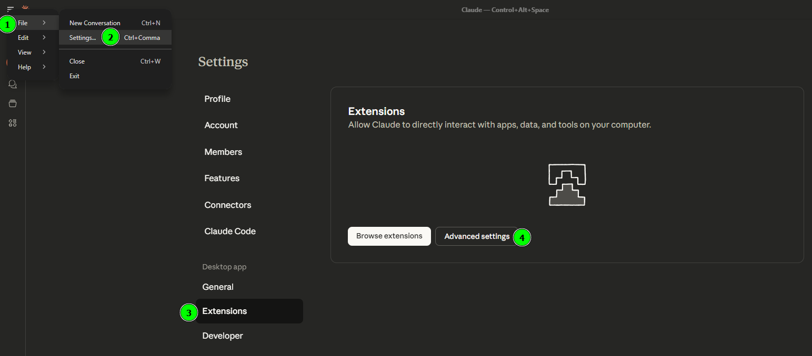
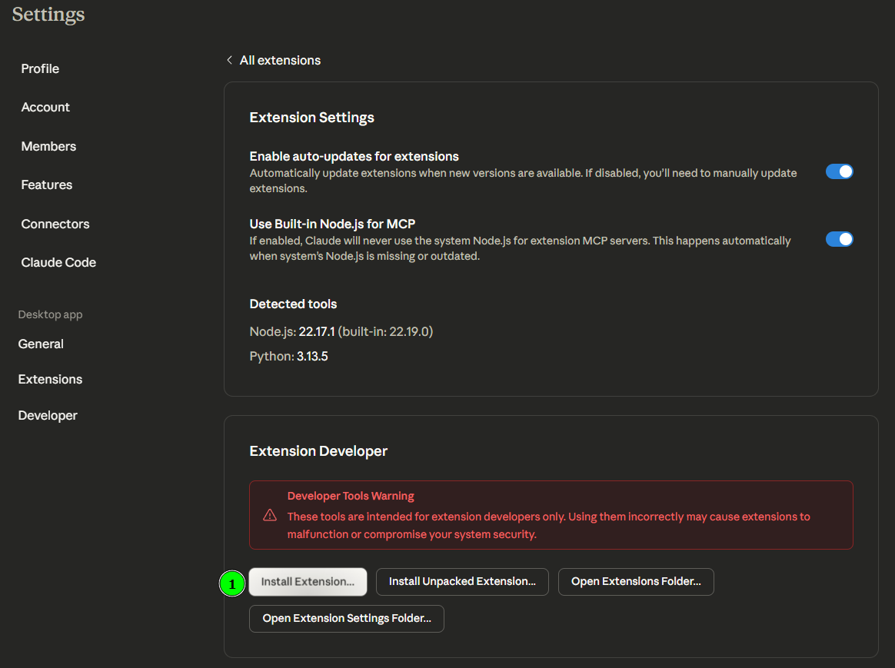
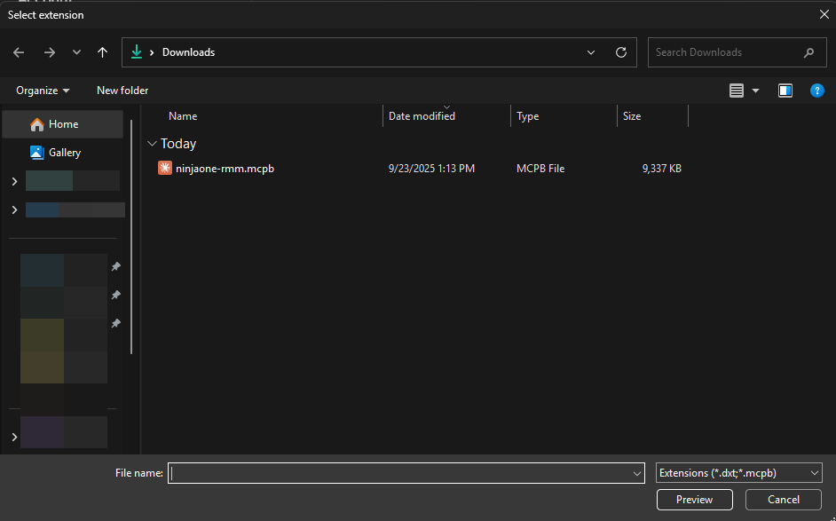
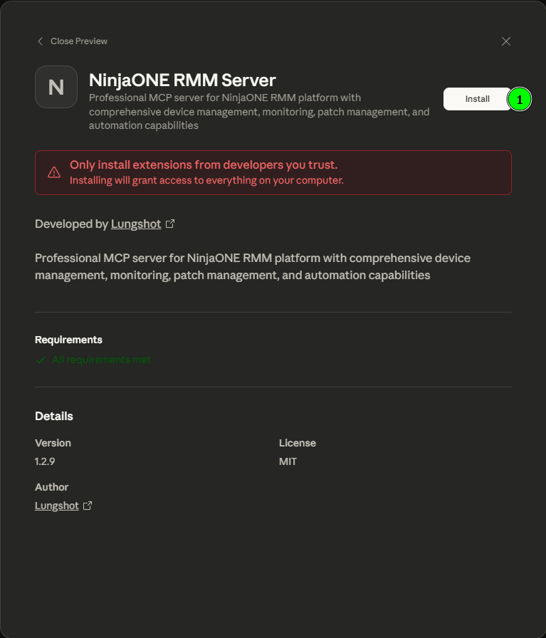
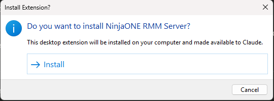
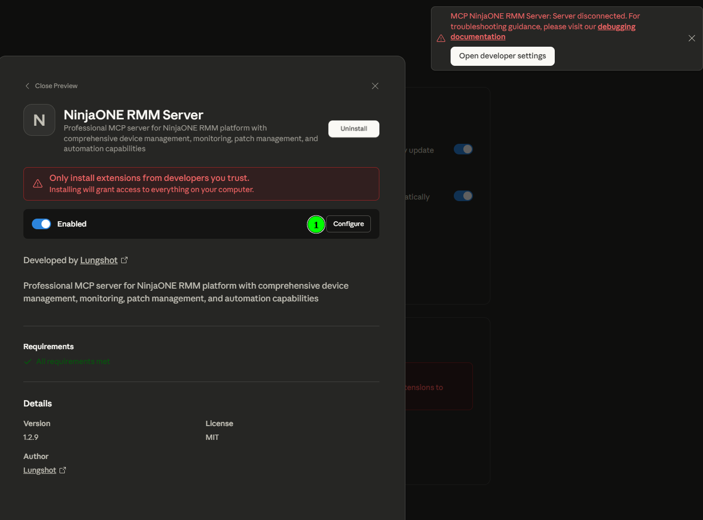

# NinjaONE MCPB (Model Context Protocol Bundle) Installation Guide

This guide provides step-by-step instructions for installing the NinjaONE RMM server as an MCPB extension in Claude Desktop.

## Features

- **Complete Device Management**: List, reboot, and maintain devices across your RMM environment
- **Health Monitoring**: Query device health, antivirus status, and system information
- **Hardware Insights**: Access processor, disk, and system hardware details
- **Software Management**: Query installed software and OS patch information
- **Patch Management**: Scan for and apply OS patches to managed devices
- **Organization Management**: Access multi-tenant organization structures

## Prerequisites

Before you begin, make sure you have:
- Claude Desktop installed on your system
- Your NinjaONE OAuth2 credentials (Client ID and Client Secret)
- Your NinjaONE regional base URL

## Installation Steps

### Step 1: Download the MCPB Package

Download the latest `ninjaone-rmm.mcpb` file from the [releases page](https://github.com/Lungshot/NinjaOneMCP/releases) or build it from source.

### Step 2: Open Claude Desktop Extensions

In Claude Desktop, navigate to the Extensions section and click "Install from MCPB file".

### Step 3: Select the MCPB File

Browse to the location where you saved the `ninjaone-rmm.mcpb` file and select it.

### Step 4: Configure Extension Settings

After installation, **click the "Configure" button** next to the extension to open the settings dialog. Enter your NinjaONE credentials:

- **NinjaONE Base URL**: Your regional API endpoint (e.g., `https://app.ninjarmm.com`, `https://eu.ninjarmm.com`)
- **OAuth Client ID**: Your NinjaONE OAuth2 application client ID
- **OAuth Client Secret**: Your NinjaONE OAuth2 application client secret

**Note**: Only these three settings are required. No refresh token is needed - the extension uses OAuth2 client credentials flow for authentication.

### Step 5: Verify Installation

Once configured, the extension should show as "Working" in the Extensions list.

### Step 6: Test the Integration

You can now use NinjaONE RMM commands in your Claude conversations! Try commands like:
- "List all devices"
- "Show device details for [device name]"
- "Get organization status"

## Configuration Details

This bundle requires the following configuration:

### Required Settings

- **NinjaONE Base URL**: Your regional API endpoint
- **OAuth Client ID**: Your NinjaONE OAuth2 application client ID
- **OAuth Client Secret**: Your NinjaONE OAuth2 application client secret

### Optional Settings

- **Log Level**: Logging level for debugging and monitoring (default: info)

## Regional Endpoints

Choose the appropriate base URL for your NinjaONE tenant:

- **US (Main)**: https://app.ninjarmm.com
- **US (Secondary)**: https://us2.ninjarmm.com
- **Europe**: https://eu.ninjarmm.com
- **Canada**: https://ca.ninjarmm.com
- **Oceania**: https://oc.ninjarmm.com

## Available Tools

### Device Management
- `get_devices` - List devices with optional filtering and pagination
- `get_device` - Get detailed information about a specific device
- `reboot_device` - Reboot a device with normal or forced mode
- `set_device_maintenance` - Set maintenance mode for a device, prompting for minutes/hours/days/weeks or a permanent window when enabling

### System Information
- `query_antivirus_status` - Query antivirus status across devices
- `query_device_health` - Query device health status information
- `query_operating_systems` - Query OS information across devices

### Hardware Information
- `query_processors` - Query processor information across devices
- `query_disks` - Query disk drive information across devices

### Software & Patches
- `query_software` - Query installed software across devices
- `query_os_patches` - Query OS patches across devices
- `scan_device_os_patches` - Scan for OS patches on a device
- `apply_device_os_patches` - Apply OS patches on a device

### Organization Management
- `get_organizations` - List all organizations with pagination
- `get_alerts` - Get system alerts with optional filtering

## Troubleshooting

### Extension Shows "Not Working"

1. **Check your credentials**: Ensure your Client ID and Client Secret are correct
2. **Verify base URL**: Make sure you're using the correct regional endpoint
3. **Check logs**: Look at the extension logs in Claude Desktop for error details
4. **Restart Claude Desktop**: Sometimes a restart helps after configuration changes

### Common Issues

- **Authentication failed**: Double-check your OAuth2 credentials in the NinjaONE dashboard
- **Wrong base URL**: Ensure you're using the correct regional endpoint for your account
- **Network connectivity**: Verify your internet connection and firewall settings

### Getting Help

If you encounter issues:
1. Check the [GitHub Issues](https://github.com/Lungshot/NinjaOneMCP/issues) page
2. Review the main [README.md](README.md) for additional configuration details
3. Create a new issue if your problem isn't already reported

## Security

- Your OAuth2 credentials are stored securely by Claude Desktop
- The extension uses client credentials OAuth2 flow - **no refresh token required**
- All API communications use HTTPS encryption
- Credentials are never logged or transmitted to third parties
- Comprehensive error handling and input validation
- Structured logging with sensitive data redaction

## Requirements

- Node.js 18.0.0 or higher
- Valid NinjaONE RMM account with API access
- OAuth2 application configured in NinjaONE

## Next Steps

Once installed and working, explore the full range of NinjaONE RMM capabilities:
- Device management and monitoring
- Patch management
- Security monitoring
- Automated maintenance tasks

Refer to the main [README.md](README.md) for complete feature documentation.

## License

MIT License - see LICENSE file for details.